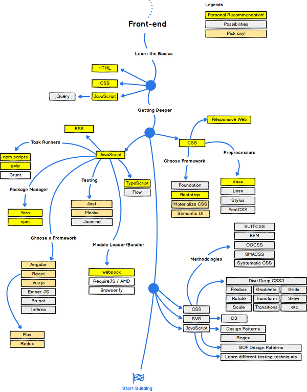

https://velopert.com/about <<이사ㄹㅏㅁ 괜춘함  

  

# Primary goal  
 

[w3schools](https://www.w3schools.com/) 진행사항  
---------------------------
### About HTML
2017-11-13_HTML HOME - https://www.w3schools.com/html/html_elements.asp  
2017-11-14_html_attributes - https://www.w3schools.com/html/html_attributes.asp  
2017-11-19_html_headings - https://www.w3schools.com/html/html_headings.asp  
2017-11-25_html_paragraphs - https://www.w3schools.com/html/html_paragraphs.asp  
2017-11-26_html_styles - https://www.w3schools.com/html/html_styles.asp  
2017-11-26_html_formatting - https://www.w3schools.com/html/html_formatting.asp  
2017-11-26_html_quotation_elements - https://www.w3schools.com/html/html_quotation_elements.asp  
2018-01-04_html_comments - https://www.w3schools.com/html/html_comments.asp  
2018-01-07_html_filepaths - https://www.w3schools.com/html/html_filepaths.asp  

다음 진행진도 -  html_head - https://www.w3schools.com/html/html_head.asp  

### About Css

## [poiemaweb](http://poiemaweb.com/) 진행사항  

## [codeacademy](https://www.codecademy.com/tracks/korean-web) 진행사항  

## [..]()  진행사항
- - -
- - -
## React vs Vue vs Angular  
* [https://kr.vuejs.org/v2/guide/comparison.html](https://kr.vuejs.org/v2/guide/comparison.html) - Vue 중심 나머지 비교  
* [https://www.slideshare.net/GunheeLee2/angular-react-vue](https://www.slideshare.net/GunheeLee2/angular-react-vue) -목적에 맞게 Angular, React, Vue  
* [https://academy.realm.io/kr/posts/react-native/](https://academy.realm.io/kr/posts/react-native/) - react&reactive&react native  
* React(React Native) vs Vue(Weex)  
> [https://da-14.com/blog/vuejs-vs-react-which-javascript-framework-choose-your-project](https://da-14.com/blog/vuejs-vs-react-which-javascript-framework-choose-your-project) - VUE.JS VS REACT: WHICH JAVASCRIPT FRAMEWORK TO CHOOSE FOR YOUR PROJECT  
> [http://blog.jeonghwan.net/vue/2017/03/29/is-vue-better-than-angular-react.html](http://blog.jeonghwan.net/vue/2017/03/29/is-vue-better-than-angular-react.html)  
> [https://joshua1988.github.io/web_dev/vue-or-react/](https://joshua1988.github.io/web_dev/vue-or-react/)  
> [https://joshua1988.github.io/web-development/translation/why-we-moved-from-angular2-to-vuejs/](https://joshua1988.github.io/web-development/translation/why-we-moved-from-angular2-to-vuejs/)  
> [https://news.ycombinator.com/item?id=15999688](https://news.ycombinator.com/item?id=15999688) -comments  
> [http://meshlabs.ghost.io/javascript-in-2017/](http://meshlabs.ghost.io/javascript-in-2017/)  

## [Vue.js](https://vuejs.org/)  진행사항
1. [https://velopert.com/3007](https://velopert.com/3007)  - velopert블로그  
2. [https://kr.vuejs.org/v2/guide/index.html](https://kr.vuejs.org/v2/guide/index.html) -한글공식가이드  
3. [http://meetup.toast.com/posts/99](http://meetup.toast.com/posts/99) -전반적인상세소개 
4. [http://vuejs.kr/jekyll/update/2017/03/02/vuejs-jquery-bootstrap/](http://vuejs.kr/jekyll/update/2017/03/02/vuejs-jquery-bootstrap/) - vue.js에서 jQuery, Bootstrap 추가하여 사용하기  
5. [https://isme2n.github.io/devlog/2017/07/19/about-vue/](https://isme2n.github.io/devlog/2017/07/19/about-vue/) -about vue 블로그  
6. [http://niceman.tistory.com/44](http://niceman.tistory.com/44)  

>* #### Tool_Library
> [https://bootstrap-vue.js.org/](https://bootstrap-vue.js.org/) -bootstrap-vue 실습장(play)제공  
> [http://vuejs.kr/](http://vuejs.kr/) - vue.js 한국사용자모임  

## [React](https://reactjs.org/) 진행사항 
1. [velopert/react-tutorial-01-outdated.md](https://gist.github.com/velopert/d76e944e13b7b0a79ff5b3e60e1b54f4)  
2. [g6ling react-native-tutorial-korean](https://www.gitbook.com/book/g6ling/react-native-tutorial-korean/details)  
3. [안녕, 리액트(Hello, React)http://blog.gaerae.com/2016/04/hello-react.html](http://blog.gaerae.com/2016/04/hello-react.html)  
4. [https://github.com/reactkr/learn-react-in-korean](https://github.com/reactkr/learn-react-in-korean)  
5. [react_pdf_30days](https://www.fullstackreact.com/assets/media/sGEMe/MNzue/30-days-of-react-ebook-fullstackio.pdf)  
6. [https://react.semantic-ui.com/introduction](https://react.semantic-ui.com/introduction)  

- - -
- - -
## Tools / 참고자료
>[https://joshua1988.github.io/web-development/translation/change-the-way-you-learn-to-code/](https://joshua1988.github.io/web-development/translation/change-the-way-you-learn-to-code/) -학습로드맵  
>[http://12bme.tistory.com/53](http://12bme.tistory.com/53) -학습로드맵2  

* Web
> [https://github.com/xguru/WebDevTutorial](https://github.com/xguru/WebDevTutorial) -for Web beginners  

* [https://codepen.io/pen/](https://codepen.io/pen/) - html,css,JS Web에서 실행  
* javascript  
> [https://30secondsofcode.org/#call](https://30secondsofcode.org/#collectinto) - 30 seconds of code  
> [http://ahnheejong.name/articles/ecmascript-tc39/](http://ahnheejong.name/articles/ecmascript-tc39/) - ECMAScript,tc39  
* 라이브러리 & 플러그 인  
> [https://speckyboy.com/top-50-javascript/](https://speckyboy.com/top-50-javascript/) - Top 50 JavaScript Plugins & Libraries for 2017   
> [https://speckyboy.com/top-50-css-2018/](https://speckyboy.com/top-50-css-2018/) -top-50-css-2018  
* [https://picturepan2.github.io/instagram.css/](https://picturepan2.github.io/instagram.css/) -Instagram.css 
* [http://stylebootstrap.info/](http://stylebootstrap.info/) -boostrap 디자인 도우미  

## Books
* 2017-11-25 html,css,javascript 책
* 2017-11-25 do it HTML5 CSS3 책  
