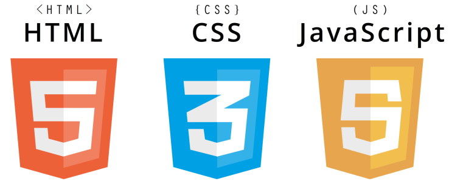

[학습로드맵](https://joshua1988.github.io/web-development/translation/change-the-way-you-learn-to-code/)  
http://12bme.tistory.com/53  
https://github.com/xguru/WebDevTutorial 

https://velopert.com/about <<이사ㄹㅏㅁ 괜춘함  

# Primary goal  
 

## Tools / 참고자료

* [https://codepen.io/pen/](https://codepen.io/pen/) - html,css,JS Web에서 실행  

* 라이브러리 & 플러그 인  
> [https://speckyboy.com/top-50-javascript/](https://speckyboy.com/top-50-javascript/) - Top 50 JavaScript Plugins & Libraries for 2017 > * [https://speckyboy.com/top-50-css-2018/](https://speckyboy.com/top-50-css-2018/) -top-50-css-2018  

* [http://stylebootstrap.info/](http://stylebootstrap.info/) -boostrap 디자인 도우미  

[w3schools](https://www.w3schools.com/) 진행사항  
---------------------------
2017-11-13_HTML HOME - https://www.w3schools.com/html/html_elements.asp  
2017-11-14_html_attributes - https://www.w3schools.com/html/html_attributes.asp  
2017-11-19_html_headings - https://www.w3schools.com/html/html_headings.asp  
2017-11-25 html,css,javascript 책  
2017-11-25 do it HTML5 CSS3 책  
2017-11-25_html_paragraphs - https://www.w3schools.com/html/html_paragraphs.asp  
2017-11-26_html_styles - https://www.w3schools.com/html/html_styles.asp  
2017-11-26_html_formatting - https://www.w3schools.com/html/html_formatting.asp  
2017-11-26_html_quotation_elements - https://www.w3schools.com/html/html_quotation_elements.asp  
2018-01-04_html_comments - https://www.w3schools.com/html/html_comments.asp  

다음 진행진도 - https://www.w3schools.com/html/html_tables.asp  

## [poiemaweb](http://poiemaweb.com/) 진행사항  

## [codeacademy](https://www.codecademy.com/tracks/korean-web) 진행사항  

## [..]()  진행사항
- - -
- - -
## [React]() 진행사항
--------------------------- 
>1. [velopert/react-tutorial-01-outdated.md](https://gist.github.com/velopert/d76e944e13b7b0a79ff5b3e60e1b54f4)  
>2. [g6ling react-native-tutorial-korean](https://www.gitbook.com/book/g6ling/react-native-tutorial-korean/details)  
>3. [안녕, 리액트(Hello, React)http://blog.gaerae.com/2016/04/hello-react.html](http://blog.gaerae.com/2016/04/hello-react.html)  
>4. [https://github.com/reactkr/learn-react-in-korean](https://github.com/reactkr/learn-react-in-korean)  
>5. [react_pdf_30days](https://www.fullstackreact.com/assets/media/sGEMe/MNzue/30-days-of-react-ebook-fullstackio.pdf)  
>6. [https://react.semantic-ui.com/introduction](https://react.semantic-ui.com/introduction)  

